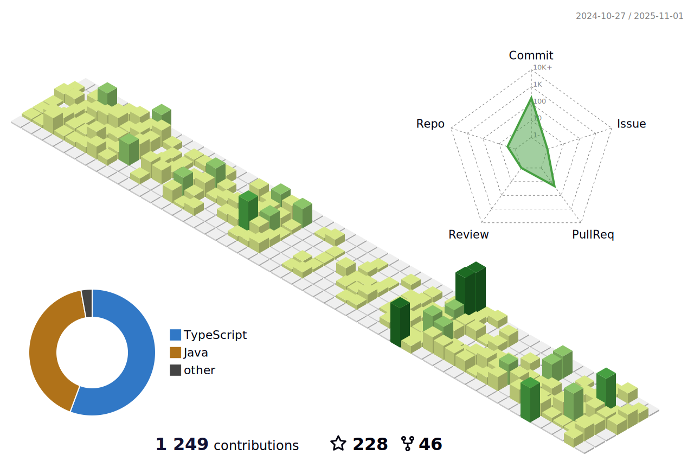

  

# 👨‍💻 Md. Salman Hossan Prottoy

  <strong>Software Engineer & Web Developer</strong>

---

## 🚀 About Me

I am a results-driven **Software Engineer** with **2+ years** of experience specializing in full-stack development, cloud architecture, and scalable web applications. Currently serving as a **Software Engineer & Sub-Lead** at **Brand Cloud Inc.** (Tokyo, Japan), working remotely from Bangladesh.

### 🎯 Core Expertise
- **Full-Stack Development**: React, Next.js, Vue.js, Node.js, Django, Go
- **Cloud & DevOps**: Docker, AWS, Firebase, Vercel, PostgreSQL, MongoDB
- **Team Leadership**: Leading cross-functional teams, code reviews, agile processes
- **Performance Optimization**: Database optimization, query tuning, system architecture

## 🛠️ Technologies & Tools

### **Frontend & UI**

### **Backend & Database**

### **DevOps & Cloud**

---

## 📫 Connect With Me

  
  
  
  
  

---

## ⚡Waka Time Stats

  

---

## 📊 GitHub Statistics

  
  

  

---

## 📈 Contribution Graph

  

---

  <em>Passionate about clean code, performance optimization, and building intuitive applications that deliver measurable business value.</em>

